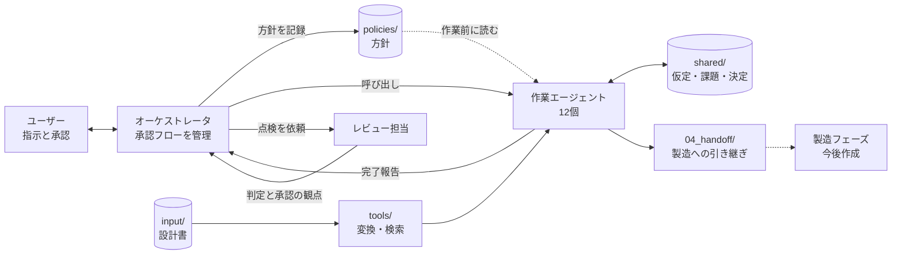
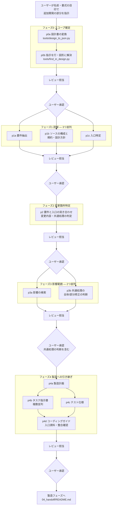

# 追加機能 影響調査プロンプト(GitHub Copilot / VS Code用)

追加開発の設計書(Excel)を入力に、既存ソースのどこをどう直すか、既存機能にどう影響するかを段階的に調査し、製造フェーズへの引き継ぎ資料(製造タスク・テスト仕様・コーディングガイド)までを作るためのプロンプト一式です。

- ユーザーが対話するのはオーケストレータだけです。オーケストレータが承認フローに沿って、各フェーズのエージェントを呼び出します。
- 各フェーズの最後に、作業に関わっていないレビュー担当が点検し、合格したものだけがユーザーの承認に進みます。承認の観点もフェーズごとに示されます。
- 追加開発の部分は、シート名・イベント名・項目名などの名前、または「赤字の行」のような書式の目印で指示します。
- 設計書は同梱のスクリプトで決定論的に変換します。セルの値だけでなく、図形・テキストボックスの文字、コメント、取り消し線・文字色、数式、画像も取り込みます。
- 共通処理に手が入る場合は、他の呼び出し元をすべて確認し、全体修正か部分修正かを判断します。
- 現行ソースのコーディング規約と設計方針を手本付きで読み取り、製造フェーズに引き継ぎます。
- やり取りの中で決まった進め方は、方針として `policies/` に蓄積され、以降の調査に適用されます。

## 使い方
1. このリポジトリと対象ソースを、1つの VS Code ワークスペースに入れる(Python が必要です)
2. 設計書(Excel)を `input/` に置く
3. Copilot Chat で `impact-orchestrator` を選び、「新しい調査を始めたい」と伝える

詳しくは [docs/usage.md](docs/usage.md) を参照してください。

## 全体の構造



## フェーズの流れ

承認はフェーズ単位です。同じ段のエージェントは並列に動き、フェーズの最後にレビュー担当が点検してから、ユーザーが承認します。



- レビュー担当の判定が fail のときは、指摘を作業エージェントに戻して直させ、再び点検します(最大2回)。
- ユーザーが差し戻すと、そのフェーズの該当エージェントを再実行し、後ろのフェーズは再実行待ちになります。

## フェーズとエージェント

| フェーズ | エージェント | 内容 |
|---|---|---|
| 0 スコープ確定 | impact-p0a-design-converter | 設計書をコピーし、変換スクリプトで JSON と Markdown に変換 |
| | impact-p0b-scope-resolver | 検索スクリプトで候補を出し、指示を設計書の行・図形に解決 |
| 1 読解 | impact-p1a-requirements | 設計書から要件を抽出(書式の目印・コメント・図形も読む) |
| | impact-p1b-codebase-profiler | 技術スタック・構成・共通部品、コーディング規約と設計方針(手本付き) |
| | impact-p1c-entrypoints | 指示の対象から既存コードの入口を特定 |
| 2 変更箇所特定 | impact-p2-changes | 要件と入口を突き合わせ、変更内容・共通処理の判定・従う規約を決める |
| 3 影響範囲 | impact-p3a-impacts | 既存機能への影響を網羅的に検索 |
| | impact-p3b-common-components | 共通処理の全体修正/部分修正を判断 |
| 4 製造への引き継ぎ | impact-p4a-work-planner | 製造タスクへの分割、製造順、完了条件、確認コマンド |
| | impact-p4b-task-writer | タスクごとの指示書(自己確認・内部レビュー・利用者承認の観点を含む) |
| | impact-p4c-test-writer | テスト仕様(新機能・回帰) |
| | impact-p4d-handoff-packager | コーディングガイド、製造フェーズの入口資料、整合確認 |
| 全フェーズ | impact-reviewer | 作業に関わっていない立場での点検、承認の観点、レビュー資料 |

## ディレクトリ構造

```
impact-analysis-prompts/
├─ README.md
├─ .github/
│  ├─ copilot-instructions.md               リポジトリ全体の指示(全チャットに自動適用)
│  └─ agents/
│     ├─ impact-orchestrator.agent.md       オーケストレータ(ユーザーが選ぶのはこれだけ)
│     ├─ impact-reviewer.agent.md           レビュー担当
│     ├─ impact-p0a-design-converter.agent.md
│     ├─ impact-p0b-scope-resolver.agent.md
│     ├─ impact-p1a-requirements.agent.md
│     ├─ impact-p1b-codebase-profiler.agent.md
│     ├─ impact-p1c-entrypoints.agent.md
│     ├─ impact-p2-changes.agent.md
│     ├─ impact-p3a-impacts.agent.md
│     ├─ impact-p3b-common-components.agent.md
│     ├─ impact-p4a-work-planner.agent.md
│     ├─ impact-p4b-task-writer.agent.md
│     ├─ impact-p4c-test-writer.agent.md
│     └─ impact-p4d-handoff-packager.agent.md
├─ docs/
│  ├─ contract.md                           取り決め(共通ルール・成果物の形式・承認の観点)
│  └─ usage.md                              使い方ガイド
├─ tools/
│  ├─ design_to_json.py                     設計書の決定論的な変換(Excel → JSON / Markdown)
│  └─ find_in_design.py                     変換済み設計書から名前・書式の目印で箇所を探す
├─ policies/                                フェーズごとの方針(やり取りの中で育つ)
│  ├─ common.md
│  ├─ phase0.md 〜 phase4.md
│  └─ CHANGELOG.md
├─ input/                                   設計書(Excel)を置く場所
└─ work/runs/{run_id}/                      調査ごとの成果物(調査を始めると作られる)
   ├─ state.yaml / scope.yaml
   ├─ 00_scope/                             設計書のコピー、変換結果、指示の解決結果
   ├─ 01_analysis/                          要件、ソースの構成、規約・設計方針、入口
   ├─ 02_changes/                           変更箇所
   ├─ 03_impacts/                           影響、共通処理の判断
   ├─ 04_handoff/                           製造への引き継ぎ一式
   │  ├─ README.md                          製造フェーズの入口(推奨する製造・承認の流れ)
   │  ├─ coding_guide.md                    コーディングガイド(規約と手本)
   │  ├─ work_plan.yaml                     製造タスク・製造順・進捗欄
   │  ├─ tasks/TSK-xxx.md                   タスクごとの指示書
   │  ├─ test_spec.yaml                     テスト仕様
   │  └─ handoff_check.yaml                 整合確認
   ├─ shared/                               仮定・課題・決定事項の台帳
   └─ review/                               フェーズごとのレビュー資料と点検結果
```

## 製造フェーズとのつなぎ方

製造フェーズ(今後作成)では、エージェント自身の承認フローを経てから利用者に承認を求める流れを想定しています。引き継ぎ資料は、その流れに沿って次を含みます。

| 製造フェーズの段階 | 引き継ぎ資料の対応箇所 |
|---|---|
| 実装 | タスク指示書の「対象ファイルと変更内容」「使う値」「従う書き方」、coding_guide.md |
| 自己確認 | タスク指示書の「完了条件」「検証手順」「セルフレビュー観点」、work_plan.yaml の確認コマンド |
| 内部レビュー | タスク指示書の「内部レビューの合格基準」「守るべき既存の振る舞い」、test_spec.yaml |
| 利用者承認 | タスク指示書の「利用者承認の観点」、work_plan.yaml の risk_level |
| 途中での確認 | タスク指示書の「作業を止めて確認する条件」「未決事項」 |
| 進捗の記録 | work_plan.yaml の status 欄 |

この調査自体も、各フェーズで「作業エージェント → レビュー担当 → ユーザー承認」と同じ型で進みます。

## 注意
各エージェントの `tools` 欄のツール名(`read`, `search`, `edit`, `execute` など)は、VS Code の更新で変わることがあります。エージェントファイルを開いてツール名に警告が出たら、「ツールの構成」から選び直してください。
